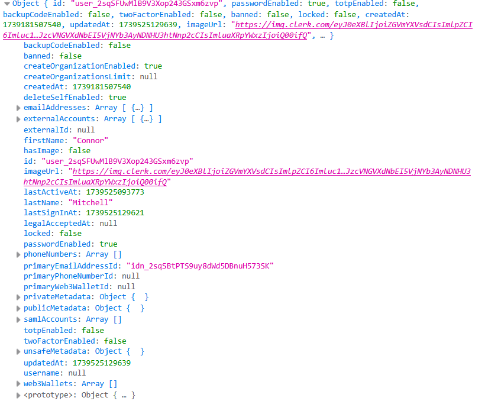

# As Yet Unnamed Social Media App

## Reflection

## Sources

UNIQUE constraint in PostgreSQL - https://neon.tech/postgresql/postgresql-tutorial/postgresql-unique-constraint
Error when trying to add data from currentUser object to formData for server action (needed JSON.stringify) - https://stackoverflow.com/questions/77091418/warning-only-plain-objects-can-be-passed-to-client-components-from-server-compo

## Screenshots

