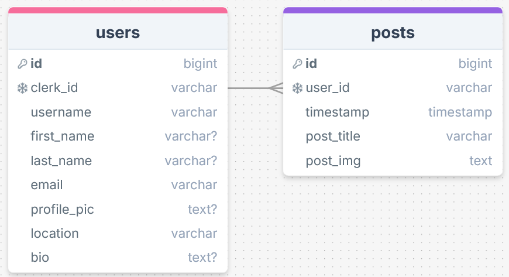

# TUSS, The Untitled Social Site

## Reflection

I'm mostly pleased with the outcome of this assignment even though I've gone a few hours passed the deadline and had to skip any CSS so the app looks somewhere between very basic and very bad.

I achieved most of the standard requirements:

- I have implemented Clerk for sign up and sign in, with users creating a profile that links their Clerk account to a user profile in the database.
- I set up one not found page in the dynamic /users/[username] route as this is my only dynamic route. I don't have any error pages though.
- I have implemented one component from radix, the separator. It's a bit of a boring one, and I couldn't get it to render vertically but I've stuck a few horizontal ones in appropriate places.
- I made a customisable user profile page where users can personalise their accounts. Users are redirected to the create-profile page after signing up and that part works fine, but I couldn't get the edit profile form to update the data even though it appears to submit successfully.
- I had the posts render in a general posts page and on the user profile so users can view all posts or narrow it to just their own posts.

I had planned to allow users to delete or edit their own posts for the stretch requirements from a dynamic /posts/[id] route but ran out of time. The plan was to query the database to select the user_id of the post then compare this to the id from currentUser using a ternary operator. If they were the same it'd be truthy and render the edit and delete buttons, or if not it'd be falsy and render nothing in that section.

My initial plan for integrating an element from a component library was to make the "edit profile" form on the user-profile page collapsible so I wanted to use either accordion or collapsible from radix, but accordion looked especially complicated and collapsible would need to be a client component and I was unsure how that would work with a form that submits data to the database with a server action. I also considered using a radix form, but decided that would be pointless since it's functionally the same as a regular form. Instead I went for possibly the most boring option: a separator. I personally like when websites use these though, and it looks nicer than changing background colour for visually separating content so I guess it's not too boring. As mentioned before, I couldn't get it to work when the orientation was set to vertical, even when copying the code directly from the example

My biggest issue here was time management. I was away most of Saturday so made sure to finish most of the Clerk work on Friday night, and had thought that what was left for Sunday (rendering posts, dynamic user profile page, radix component, and CSS/media queries) wouldn't take too long but it took longer than expected so I ended up only doing what was needed for functionality. That left me without time to make the site look nicer with CSS or to fix some bugs by taking some time off to think about or research the issue.

Overall, I'm happy with what I achieved but if I'd managed my time better and given myself just a few more hours it could've been significantly better.

## Errors

I didn't run into any huge errors this time.

The first one was in the create-profile route when trying to include data from the currentUser object in the formData object to be submitted to the database. I got an error saying that only plain objects could be included in server actions so google told me I had to JSON.stringify it which I did. I spent a long time investigating the structure of the JSON object to see why the data I was pulling out of it was undefined, and eventually asked Cameron who told me it was because I'd stringified the whole object and should've instead stringified the specific data I wanted (just id and email). I did this and not only did it work, but I actually understand why the error happened and exactly what fixed it, so that felt pretty good.

The main error I got was a strange one as it seemed to be incorrect. It was a Clerk error (I didn't take a screenshot annoyingly) telling me that I'd called auth() but hadn't included it in my middleware.js, and should try moving my middleware.js file to src or ensuring that clerkMiddleware() was included in it. I'd already done both of these things in the initial set up of my middleware, and didn't have to do anything to my middleware file to fix the error so I'm guessing it was some sort of default error that shows up when there's a Clerk problem even if that's not the actual issue. That's a complete guess though, and all that google revealed were people having that issue legitimately and having to move their middleware file.

Not fully an error, but I had a hard time setting up my home page because of some data wrangling to make sure the dynamic user profile link worked when signed in but didn't exist when signed out. I used the currentUser object and queried the database with the id to find matching usernames for signed in users to link to their profiles, but then I had the issue that this was an empty array for users who weren't signed in. I added the data wrangling and the query to an if conditional so it only happened if the parsed currentUser object wasn't null. The next problem came with Clerk's SignedIn and SignedOut components though, as the SignedIn component included a Link using the result of the aforementioned query. Even though this wasn't rendered for SignedOut, I guess the code still ran because it threw an error as href used an undefined variable. I saw a lovely opportunity for a ternary operator and used it along with an empty let variable (I haven't used 'let' instead of 'const' for ages so it felt like bad practice) to make my messiest code ever but it worked.

## Sources

UNIQUE constraint in PostgreSQL - https://neon.tech/postgresql/postgresql-tutorial/postgresql-unique-constraint
Error when trying to add data from currentUser object to formData for server action (needed JSON.stringify) - https://stackoverflow.com/questions/77091418/warning-only-plain-objects-can-be-passed-to-client-components-from-server-compo
JSON viewer (used to debug my json object) - https://jsonviewer.stack.hu/
Postgresql add column with ALTER (to add user submitted alttext to posts) - https://www.w3schools.com/postgresql/postgresql_add_column.php
Radix separator primitive - https://www.radix-ui.com/primitives/docs/components/separator

## Screenshots

currentUser object, my best frenemy during this assignment:

DrawSQL showing initial db schema, but I later added a column in posts for alt text:

Wireframe showing all of my pages squashed into one screenshot:

Trello showing how I organised tasks and which planned tasks I had left to do:

